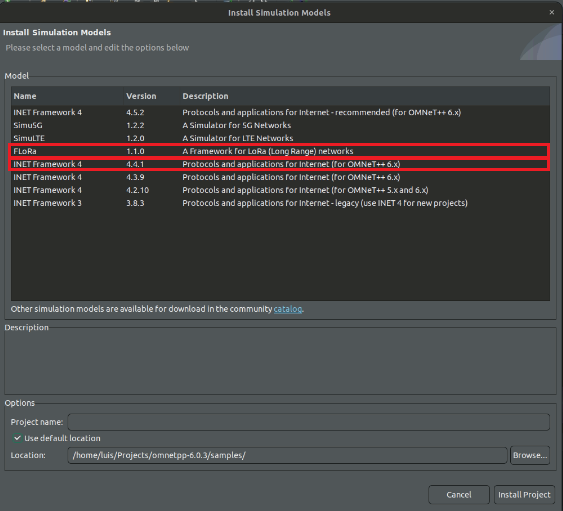
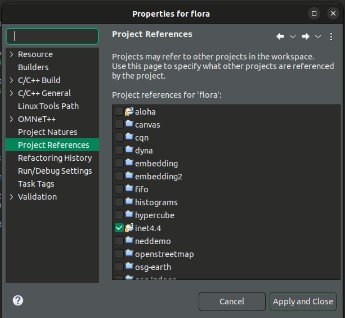

# Relay-Gateway

Repository for implementation of the Relay-Gateway in FLoRa.

## Prerequisites

- OMNeT++  6.0.3v
- INET Framework 4 4.4.1v
- FLoRa 1.1.0

INET and FLoRa are modules that can be instaled from the GUI of OMNeT. It's under `Help` then `Install Simullation Models` and select the correspondent models as shown in the next picture.

*Note:* check that INET is the project reference for FLoRa. Right click of the folder of FLoRa and go to properties then `project references` as shown below.  
  

## Files Structure

All the simulations on FLoRa are under the folder *simulations*, so almost all modification and configuration will be done there.

### .ini Files

The .ini files are in charge of define all parameters and execute the simulation.  

Inside *simulations* folder is created a folder *multihop*, where all the .ini files will be stored.(In *docs* there is that folder with those files used for the research) Two were created `Base.ini` for default LoRaWAN configuration and `ReleGateWay.ini` for multihop solution.

### .ned Files

This files describes in general the simulation, mainly defining the modules to be used and their connections.  

Inside the simulation folder the file `package.ned` was replicated and modified, one with the name `packageBase.ned` and the other `packageGW.ned`. One for default onehop solution and the other for the Rele Gateway solution respectively.  

### src .ned file

This file is needed for the Rele Gateway in the `package.ned` file, but this .ned should be located in the `src` folder(isn't inside `simulations` folder) and inside `LoRaNode` folder.

This file is similar al `LoRaGW.ned` placed in the same folder, and we call it `LoRaReleGW.ned`. Also this file is available inside the *docs* folder too.

## Simulation

The simulation is based on the files i  th folder *docs*  and the structure described in the previous section, also the parameters that are defined in the .ini file. In the next table the parameters are shown.

| Parameter          | Value     |
| ------------------ | --------- |
| simulation time    | 86 400    |
| number of packets  | 1         |
| interval           | 10 s      |
| Transmission Power | 14 dBm    |
| Spreading Factor   | 7,8,10,12 |
| Bandwidth          | 125 kHz   |
| Channel Frequency  | 868MHz    |
| Codding Rate       | 4/8       |
| Packet Size        | 50 Bytes  |
| ADR                | None      |  
